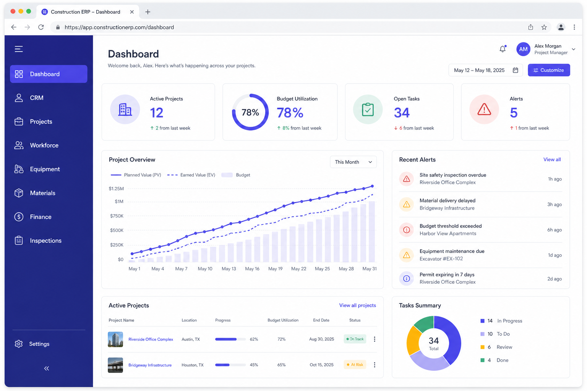
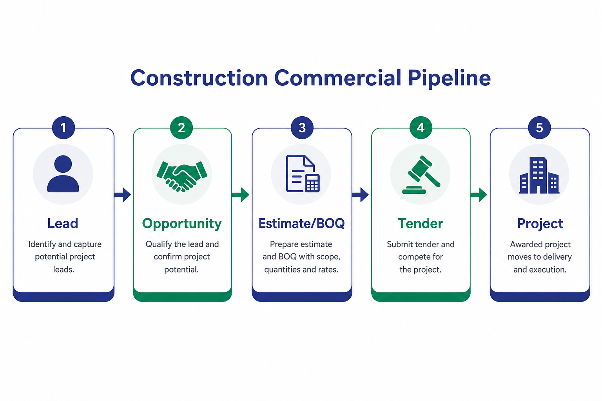
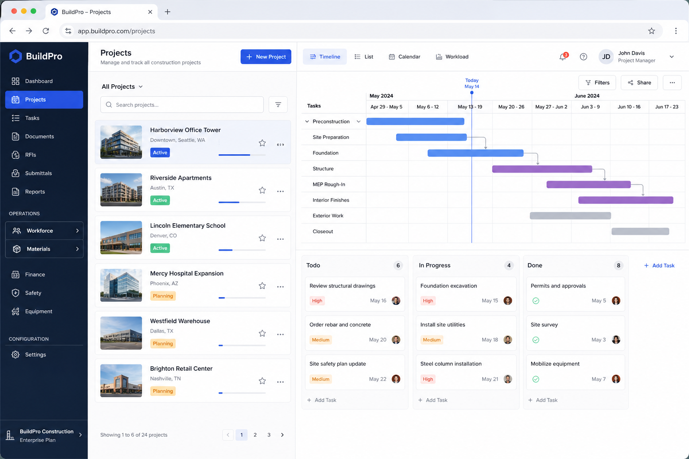
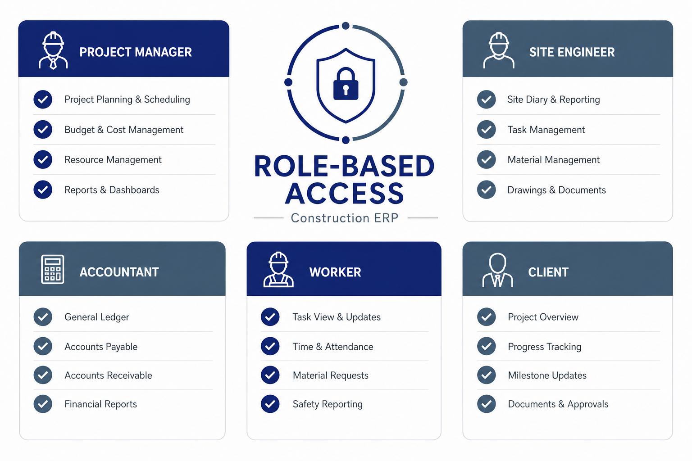

# BuildMind — Construction ERP Marketing Site

Public marketing website for **BuildMind** (construction ERP SaaS). This repository is **public** so prospects can learn about the platform, request demos, and see product capabilities.

The **portal** (team app) and **API** (backend) are maintained in **private repositories** for licensed clients. This README is the public product overview for sales, marketing, and GitHub visitors.

---

## What is BuildMind?

BuildMind is an **automation-first construction ERP** for general contractors, builders, and multi-branch construction companies. It connects commercial work (leads, estimates, tenders) with delivery (projects, workforce, materials, equipment, inspections) and financial control — in one role-based platform.

**Who it’s for:**

| Persona | What they get |
|---------|----------------|
| **Business owner** | Executive Command Center, finance KPIs, reports |
| **Operations / construction manager** | Full site operations, procurement, workforce |
| **Project manager** | Projects, milestones, tasks, documents |
| **Site engineer / supervisor** | Tasks, inspections, attendance, materials usage |
| **Accountant** | Budgets, invoices, payments, aging, general ledger |
| **Field worker** | Shift schedule, attendance, assigned tasks |
| **Client** | Separate client portal — progress, approvals, invoices |  

---

## Platform at a glance



| Area | Modules |
|------|---------|
| **Overview** | Project dashboard, Executive Command Center |
| **Commercial** | CRM & leads, estimates & BOQ, tender management |
| **Delivery** | Projects, task board, workforce, equipment, materials & procurement, inspections, documents |
| **Finance** | Budgets, expenses, invoices, payments, reports, general ledger *(Enterprise)* |
| **Intelligence** | AI assistant, automation alerts, notification center |
| **Admin** | Multi-company, multi-branch, audit log, role permissions |

---

## Commercial pipeline

From first contact to live project — without spreadsheets:

```
Lead  →  Opportunity  →  Estimate (BOQ)  →  Tender  →  Project
```



1. **CRM** — capture leads, log activities, qualify opportunities  
2. **Pre-construction** — build versioned BOQ estimates; track tender deadlines  
3. **Win** — convert opportunity to project with budget seeded from the estimate  
4. **Deliver** — milestones, tasks, progress %, schedule variance, risk scoring  

---

## Operations & site delivery



| Module | Capabilities |
|--------|--------------|
| **Projects** | Milestones, tasks, Gantt timeline, progress reports (daily / weekly / monthly) |
| **Task board** | Kanban for office and field teams |
| **Workforce** | Shift scheduling, attendance, shift requests, payroll runs, worker self-service portal |
| **Materials** | Inventory, suppliers, site usage, low-stock alerts |
| **Procurement** | Purchase requests → approval → PO → delivery → GRN (goods receipt) |
| **Equipment** | Asset registry, assignments, maintenance, fuel logs, utilization |
| **Inspections** | Site / safety / quality checklists, issues, photo evidence |
| **Documents** | Permits, contracts, drawings — per project, with expiry alerts |

---

## Finance & control

- Project **budgets** with threshold alerts  
- **Expenses** with approval workflow  
- **Client invoices** and **payments**  
- **AR/AP aging** and **cash-flow forecast**  
- **Milestone-triggered** draft invoices (automation)  
- **General ledger** — chart of accounts and journal entries *(Enterprise tier)*  
- **Construction reports** — PDF / Excel export across projects, workforce, materials, finance  

---

## Automation & AI

BuildMind is built to **act**, not just store data:

| Automation | What it does |
|------------|--------------|
| Overdue tasks | Flags slipped work before it becomes a crisis |
| Low inventory | Drafts purchase requests when stock drops |
| Budget alerts | Warns when spend approaches limits |
| Project delays | Surfaces schedule risk in Command Center |
| Maintenance due | Equipment service reminders |
| Tender deadlines | Submission date tracking |
| Client digest | Optional weekly project summary email |

**AI Center** — construction-scoped assistant with session history and automation run log. Embedded command bar on key modules (e.g. projects, materials).

---

## Role-based access

Each user sees only what their job requires. Navigation is computed from role — field workers don’t see finance; accountants don’t see procurement approval queues unless permitted.



| Role | Typical access |
|------|----------------|
| Executive / Admin | All modules + company & branch setup |
| Construction manager | Full construction + business targets |
| Branch manager | Branch-scoped construction modules |
| Project manager | Projects, tasks, workforce, materials, finance |
| Site engineer | Projects, tasks, equipment, inspections |
| Supervisor | + workforce attendance |
| Accountant | Finance, reports, executive KPIs |
| Worker / contractor | Workforce portal, assigned tasks |
| Client | Client portal only (separate login) |

---

## Multi-branch & localization

- **Company → branch → project** hierarchy  
- Per-branch **timezone** and **currency** (e.g. PKR, USD)  
- Branch filters on estimates, tenders, projects, and finance for accurate reporting  

---

## Client portal

External clients get a dedicated login (not the internal ERP):

- View **project progress**  
- **Approve or reject** milestone deliverables  
- See **invoices** and payment status  
- Optional **weekly digest** email  

---

## This repository (`BuildMind_Website`)

| Item | Description |
|------|-------------|
| **Purpose** | Public marketing site — Home, About, Pricing, Blog, Contact, Request Demo |
| **Stack** | React 18, Vite, Tailwind CSS |
| **Demo form** | Posts to `{API}/api/demo-requests` |
| **Portal link** | “Log in” uses `VITE_PORTAL_ORIGIN` (private portal deployment) |

### Related (private) repositories

| Repo | Visibility | Purpose |
|------|------------|---------|
| Portal (`BuildMind_front`) | Private | React app your construction team uses daily |
| API (`BuildMind_backend`) | Private | Node.js + MySQL backend, automation, AI |
| **Website (`BuildMind_Website`)** | **Public** | Marketing & product information (this repo) |

> Licensed clients receive access to private portal and API repositories. Product documentation for implementations lives in those repos.

---

## Screenshots

Product flow visuals for proposals and this README:

| File | Description |
|------|-------------|
| [`docs/screenshots/executive-dashboard.png`](docs/screenshots/executive-dashboard.png) | Executive / KPI overview |
| [`docs/screenshots/commercial-flow.png`](docs/screenshots/commercial-flow.png) | Lead → project pipeline |
| [`docs/screenshots/project-operations.png`](docs/screenshots/project-operations.png) | Projects, tasks, timeline |
| [`docs/screenshots/role-access.png`](docs/screenshots/role-access.png) | Role-based module access |

Replace with live staging screenshots when preparing client-specific proposals.

---

## Developer setup

### Prerequisites

- Node.js 18+
- BuildMind API running (for demo form and visit tracking)

### Install & run

```bash
npm install
cp .env
npm run dev
```

### Environment variables

| Variable | Description | Example |
|----------|-------------|---------|
| `VITE_API_BASE_URL` | Backend origin (**no** `/api` suffix) | `http://localhost:5002` |
| `VITE_PORTAL_ORIGIN` | Portal URL for “Log in” button | `https://portal.yourdomain.com` |

The **Request Demo** page submits to:

```
{VITE_API_BASE_URL}/api/demo-requests
```

### Production (e.g. Vercel)

1. In the Vercel project for **fleetWebsite**, add:
   - `VITE_API_BASE_URL` = your live API origin, e.g. `https://yourdomain.com` (**HTTPS**, no `/api` suffix)
   - `VITE_PORTAL_ORIGIN` = your portal URL
2. **Redeploy** after saving env vars (Vite bakes `VITE_*` at build time).
3. Quick check: open `https://YOUR_API/health` (or `/api/demo-requests` OPTIONS) in a browser — it must load over HTTPS.

If submit shows **Failed to fetch**, the marketing site cannot reach that API URL (missing env, HTTP mixed content, or API down).

---

## 15-minute demo script (for sales)

| Step | Show | Message |
|------|------|---------|
| 1 | Executive Command Center | “What needs attention today?” |
| 2 | CRM → Estimates & tenders | “How we win work” |
| 3 | Project detail + task board | “How we deliver on site” |
| 4 | Materials & procurement | “How we control cost and stock” |
| 5 | Finance + reports | “How owners stay in control” |
| 6 | Client portal | “What your clients see” |

**CTA:** [Request a demo](/request-demo) on the live site.

---

## Branding

- **Product name:** BuildMind Construction ERP  
- **Marketing site:** This repository (`BuildMind_website`)  
- **Tagline:** AI-powered construction operations — projects, workforce, materials, and equipment in one platform  

---

## License & access

- This marketing site is **open source / public** for visibility.  
- Portal and API source code are **private** and provided to licensed customers under separate agreement.  
- For demos, pricing, or implementation: use the **Request Demo** form on the deployed site or contact via the **Contact** page.
